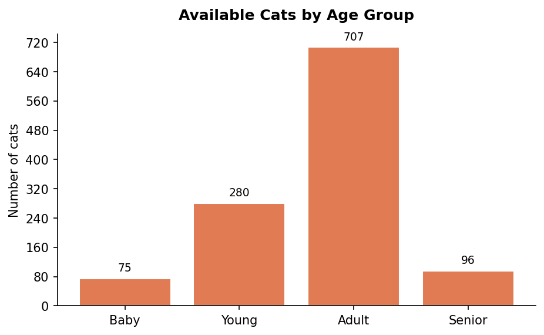

# Cat Shelter Pipeline 🐱

An end-to-end ETL data pipeline that extracts real-world cat adoption data from the [RescueGroups.org v5 API](https://rescuegroups.org/services/adoptable-pet-data-api/), transforms it using pandas, and loads it into a local SQLite database for analysis.

This project was built to map existing data engineering skills (SSIS, Power Query M, SQL) onto Python equivalents.

---

## What It Does

| Stage | Tool | BI Equivalent |
|---|---|---|
| **Extract** | `requests` → RescueGroups.org v5 API | SSIS connection manager / OData source |
| **Transform** | `pandas` | Power Query M / SSIS data flow |
| **Load** | `sqlite3` | SQL Server staging table |

---

## Project Structure

```
cat_shelter_pipeline/
├── extract.py          # API calls to RescueGroups, returns raw JSON
├── transform.py        # pandas transformations, cleaning, shaping
├── load.py             # writes transformed data to SQLite
├── pipeline.py         # orchestrates extract → transform → load
├── .env.example        # template for API credentials
└── cats.db             # SQLite database output (gitignored)
```

> ⚠️ *Update file names above to match your actual structure if different.*

---

## Skills Demonstrated

- Authenticating with and calling a REST API (`requests`)
- Parsing and normalising nested JSON into a flat DataFrame
- Data cleaning and transformation with `pandas`
- Loading data into SQLite using `sqlite3` / `pandas.to_sql()`
- Managing secrets with `python-dotenv`
- Structuring code as a modular ETL pipeline (not just a notebook)

---

## Getting Started

### 1. Get a RescueGroups API key

Sign up at [rescuegroups.org](https://rescuegroups.org) to request access to the v5 API.

### 2. Configure your environment

```bash
cp .env.example .env
```

Edit `.env` and add your credentials:

```
RESCUEGROUPS_API_KEY=your_api_key_here
```

### 3. Install dependencies

```bash
pip install -r requirements.txt
```

### 4. Run the pipeline

```bash
python pipeline.py
```

---

## How This Maps to My BI Background

| Python concept | What I already knew |
|---|---|
| `pandas` DataFrame | Power Query M table / SQL result set |
| `df.rename()`, `df.fillna()` | Power Query M column operations |
| `df.to_sql()` | SSIS OLE DB Destination |
| `pipeline.py` orchestration | SSIS package control flow |
| `sqlite3` database | SQL Server / local database |
| `.env` secrets file | SSIS connection manager config |

---

## Dependencies

See [`requirements.txt`](../requirements.txt) in the root of the repo.

Key packages: `requests`, `pandas`, `python-dotenv`

## Sample Output

